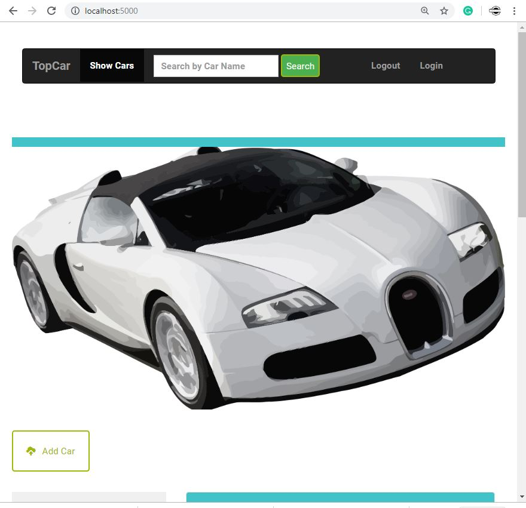
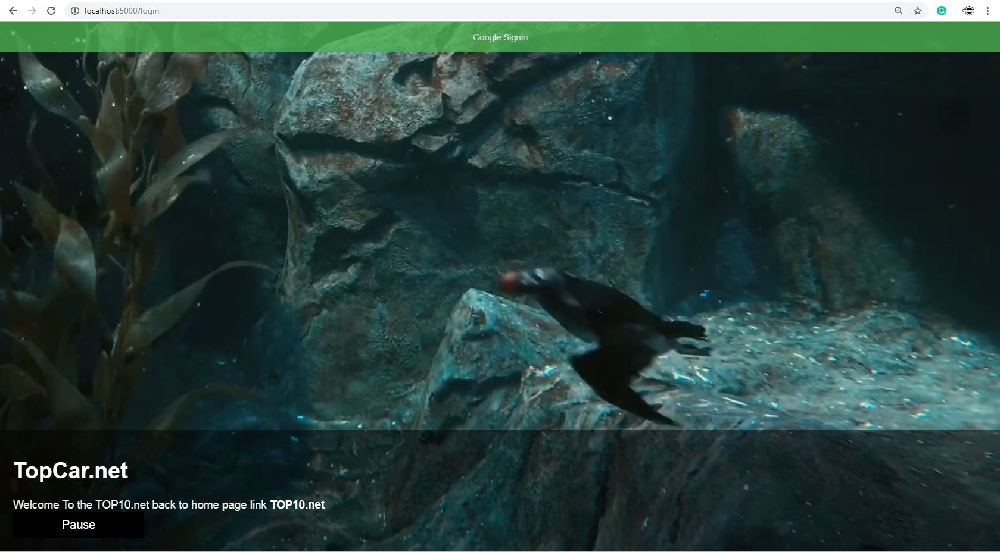
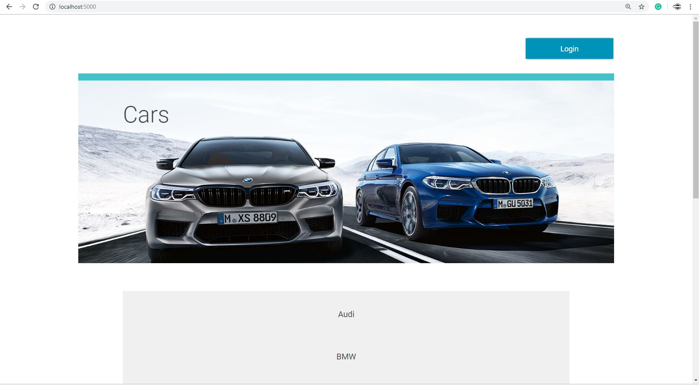

# Item Catalog Web app - Udacity (Top Cars)
### Full Stack Web Development ND
[Udacity.com](https://www.udacity.com)

_____________________

# About
REST Full app , can read and update and create and delete data from database, it has : Authentication &amp; Authorization Page implements a third-party authentication &amp; authorization service Google Accounts instead of implementing its own authentication &amp; authorization spec.there a “login” and “logout” button/link in the website?

# Prerequisites
* Python: 3.8 https://www.python.org/downloads/release/python-380/  
* Vagrant: https://releases.hashicorp.com/vagrant/  
* VirtualBox: 3 
* Git : https://git-scm.com/downloads 

# last update:
* fixed the problem in the showPost() function to make it
* don't allow non creator of the post or item in the menu to change the post

# Notes Before Using this App 
* You can search only By car name not the company name.
* this lastadded section show you Last added posts not lists in order to make it Like this below
* 128(Fiat).

## How To set up VM and use this app on windows:

We're using tools called Vagrant and VirtualBox to install and manage the VM. 
You'll need to install these to do some of the exercises. 
The instructions on this page will help you do this.

[Download This File](https://github.com/udacity/fullstack-nanodegree-vm)

1. Download virtualBox, vagrant, GitBash
2. install them 
3. access vagrant file that You have downloadead
4. type vagrant up [Enter] 'It Will take long time'
5. type vagrant ssh

## how to access vagrant file:
1.  unzip The file u have downloaded and put it in Downloads folder.
2.  open GitBash and type cd Downloads [Enter]
3.  then ls and copy the file name Then click paste or control [shift] + [insert]
4.  use cd on the file name fullstack-nanodegree-vm
5.  then cd vagrant , and run vagrant up and vagrant ssh

## Getting an error in Setup VM?
1.  install another VM Verssion
2.  try To Re-Install the vagrant and Virtualbox
3.  else Search google

# Database Tables :

# 1- Users  
### (Primary Key : id)

#### containes userinfo which provided By Google+ API and Ouath2

id | name | email | picture
--- | --- | --- | ---
*integer* | `text` | **text** | **Text**

# 2- Car 
###  (Primary Key : id, UNIQUE CONSTRAINT : user_id, foreign Key: Users)

#### containes A list of Cars in the same Company (like Audi), To add new List,  
#### all post inherts will have same company Name 
name | id  
--- | ---  
**Text** | **integer**

# 3- CarType
### (Primary Key : id  UNIQUE CONSTRAINT : user_id,car_id, foreign Key: Users, Car)

#### containes Cars Posts and post info

Name | Id | description | price | car_id | user_id
--- | --- | --- | --- | --- | --- 
 **text** | **inet** | **text** | **text** | **integer** | **integer**
 
 
# Features and Functions

1.  The project implements a JSON endpoint that serves the same information.
2.  Website reads category and item information from a database.
3.  Website includes a form allowing users to add new items and correctly processes submitted forms.
4.  Website include a form to edit/update a current record in the database table and correctly processes submitted forms.
5.  Website does include a function to delete a current record.
6.  Do create, delete, and update operations consider authorization status prior to execution
7.  implements a third-party (Google Accounts) instead of implementing its own authentication & authorization spec.
8.  there is a 'Login' and 'Logout' button/link in the project. 
9.  neatly formatted and compliant with the Python PEP 8 style guide.
10. comments present and effectively explain longer code procedures.
11.  full responsive.
12.  working searching Filed.
13.  Using some Python function to add some AI to the web app.
14.  Using HTML5 to add cool things like Sound You Heared when You start the app first time.
15.  using Pure JS to add some function and make the app more smart.

# Why You Have To use this app
*  You can sell Your car or cars easy (<strong>New</strong> or Used) Cars.
*  The first application in the world through which you can buy an unused car from many suppliers and get offers on new cars.
*  Your selling Posts Available until u remove it.
*  You can use search for all selling Posts. 
*  Your login and information are handled By Google so You are super secured.
*  You can add any Number of selling Posts.
*  You Can Deal direct with the buyer without broker.
*  You will enjoy dealing with an easy-to-use user interface.

# some code quoted from another source from: 
1.  www.Udacity.com
2.  www.w3schools.com
3.  https://realpython.com/
4.  https://stackoverflow.com/
5.  https://www.facebook.com/groups/pythoncodingprogrammingselfinstructionhub/ (python Group)

# Editors to create this:
*  Normal notePad.
*  w3schools (Try it tool) editor with teseter and mark errors.
*  IDLE Python Shell 3.7 (32-bit).

# Udacity.com review

# Screenshots

   
## Developed and maintained By:
   ### Mahmoud Hegazy   
   
